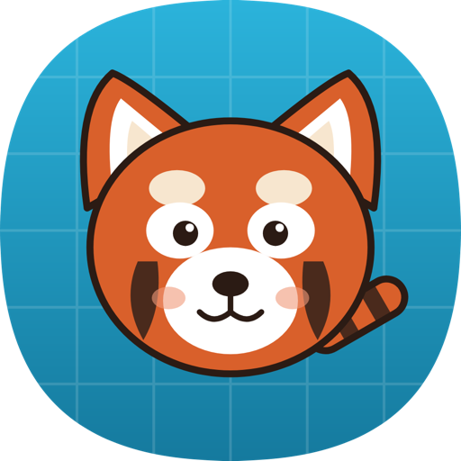

# CodeTrail

A desktop puzzle game that teaches kids the first ideas of programming: sequences, turns,
jumps and reading code. Pick a hero, build a program out of command cards, run it and watch
the hero walk the trail to the goal.

Inspired by the Danish "Programmering" worksheets by mattip.dk.



## Features

- **Generated levels** - every level is built on the fly and is guaranteed solvable.
  The generator carves a single thin corridor first, then fills the rest with water, lava or
  space. A BFS solver verifies each level and computes the shortest program for star ratings.
  Loop and block levels are built around a repeated shape (a staircase, a snake or a run of
  hops): chained for loops, spread along the path for blocks. The shortest program is folded
  into loops and a block before rating, so the slot budget rewards the idea being taught.
- **Six difficulty tiers**, following the worksheet progression and then going one step further:
  1. arrows: up / down / left / right
  2. longer paths
  3. relative commands: forward X, turn left / right
  4. jumps over obstacles
  5. loops: "repeat N times" on a bigger board with more obstacles and a slot budget that
     only fits a looping program
  6. blocks: one reusable "block A" of 3-4 cards, defined once and called from several places
- **Two modes** - build the path, or read a given program and guess where the hero stops.
- **Six worlds** - Islands, Forest, Space, Ice, City, Lava - all drawn procedurally on a Canvas.
- **Five heroes** unlocked with stars: turtle, penguin, fox, bear and the red panda.
  Harder tiers pay more stars (rating x tier).
- **Profiles** are save slots: progress, hero choice and the level in progress are stored per
  profile and the game resumes exactly where it was left. A profile moves between devices as a
  copy-paste code (`CT1.` + Base64 of its save file) or, on desktop and web, as a file.
- **Editing that works on a tablet and with a mouse**: tap a tray card to add it after the
  selected one, tap a program card to select it (delete badge, -/+ for numbers), drag cards from
  the tray or within the program to place them exactly, Undo for every change.
- **Card legend**: a "?" badge on the card tray lists the cards of the current tier with one
  line each on what they do.
- **Hints** that point at the next card, failure scenes (splash, bump, head shake), confetti
  and star bursts on a win.
- **English, Russian, Ukrainian and Danish** UI.
- **Runs on the desktop, in the browser and on Android** from the same code: native
  installers for macOS, Windows and Linux, a Kotlin/Wasm build served from GitHub Pages, and
  an APK for tablets.

## Project layout

```
core/      Kotlin Multiplatform, no UI: grid model, commands, interpreter, solver,
           level generator, predict puzzles, progress model.
app/       Compose Multiplatform app.
           commonMain: screens, board rendering, world art, game and app state, sound
           synthesis, strings, font and hero SVGs (Compose Resources).
           jvmMain: desktop window, file storage, audio output, installer configuration,
           snapshot and render tools.
           wasmJsMain: browser entry point, localStorage saves, Web Audio, index.html.
           androidMain: file storage, AudioTrack output, locale.
android/   Thin Android application module: activity, manifest, launcher icons, APK packaging.
assets/    App icon sources and the hero SVG masters (converted to XML vectors by tools/svg2vd.py).
tools/     Build-time helpers.
```

The core never touches strings, colours or files. The app's `commonMain` has no platform
code either: each target reimplements only storage, the audio device, locale handling and
the entry point (about 200 lines for the browser).

## Running

Requires a JDK 21+.

```bash
./gradlew :app:run
```

Print sample levels for every tier and stress-test the generator:

```bash
./gradlew :core:demo -Pseed=7
```

Render any screen to a PNG without opening a window (handy for checking layout):

```bash
./gradlew :app:snapshot -Pscreen=play -Pstars=30 -Plang=ru -Pout=build/play.png
./gradlew :app:snapshot -Ptier=4 -Pseed=7 -Pworld=lava -Phero=fox -Psolve -Pframe=700 -Pout=build/win.png
```

Options: `screen` (menu, profiles, play, settings, stats, quit, pause, game), `tier`, `seed`,
`world`, `hero`, `mode` (forward, predict), `lang`, `stars`, `frame` (animation time in ms),
`solve` / `fail` / `hint`.

## Web build

```bash
./gradlew :app:wasmJsBrowserDistribution
```

Produces a static site in `app/build/dist/wasmJs/productionExecutable/` (about 14 MB:
Skia and the app as Wasm, plus resources). Serve it from any static host; locally for example

```bash
python3 -m http.server 8765 --directory app/build/dist/wasmJs/productionExecutable
```

It needs a browser with WasmGC: Chrome / Edge 119+, Firefox 120+, Safari 18+. Saves live in
the browser's `localStorage`. The fixed 1280x800 layout is scaled to fit the window. Switching
the UI language reloads the page, because Compose resources read the browser language once.

The release workflow publishes this build to GitHub Pages on every `v*` tag (one-time setup:
repository Settings -> Pages -> Source: GitHub Actions) and attaches it to the release as
`codetrail-web.zip`.

## Android

```bash
./gradlew :android:assembleDebug      # android/build/outputs/apk/debug/android-debug.apk
```

Needs the Android SDK (`local.properties` with `sdk.dir=...`, or `ANDROID_HOME`). Min SDK 26,
landscape only: the 1280x800 scene is scaled to fill the screen, so the game is comfortable on
tablets and works, if small, on phones.

Hero art: Compose resources cannot render SVG on Android, so the shipped drawables are XML
vectors generated from the SVG masters:

```bash
tools/svg2vd.py assets/characters/*.svg -o app/src/commonMain/composeResources/drawable
```

The release workflow attaches `codetrail-android.apk` to each release and also builds the
App Bundle (`codetrail-android.aab`) for Google Play. Both are signed with the release key when
the repository has these secrets, and with the debug key otherwise:

```
ANDROID_KEYSTORE_BASE64    the .jks file, base64-encoded
ANDROID_KEYSTORE_PASSWORD
ANDROID_KEY_ALIAS
ANDROID_KEY_PASSWORD
```

Locally, export the same values plus `ANDROID_KEYSTORE_FILE=/path/to/release.jks` before running
`:android:bundleRelease`. The privacy policy required by Play is served with the web build at
`/privacy.html`. A one-page guide for teachers (Danish) is served at `/skole.html`.

## Installers

Native packages are built with `jpackage`; the JVM is bundled so players do not need Java.

```bash
./gradlew :app:packageDmg   # macOS, run on macOS
./gradlew :app:packageMsi   # Windows, run on Windows with WiX 3.x installed
./gradlew :app:packageDeb   # Linux
```

`jpackage` cannot cross-compile. The GitHub Actions workflow in `.github/workflows/release.yml`
builds all three on a tag `v*`, plus the web build, and attaches them to a release.

Packages are unsigned: macOS Gatekeeper and Windows SmartScreen will warn on first launch.

## Save files

```
~/.codetrail/settings.properties          language, sound, speed, last profile
~/.codetrail/profiles/<id>.properties     one file per profile
```

Plain text; delete a file to remove a profile. The browser build keeps the same key=value
text in `localStorage` under `codetrail.settings` and `codetrail.profile.<id>`. The Profiles
screen exports a profile as a `CT1.` code (Base64 of that text) or a `.properties` file and
imports either; importing a name that already exists asks whether to replace it or add a copy.

## Adding content

- **A world**: add a `WorldTheme` (palette) and a `WorldArt` object (goal, obstacle, props)
  in `app/src/commonMain/kotlin/codetrail/app/theme/`, plus name / goal / fall-message strings in the four
  `strings.xml` files.
- **A hero**: draw an SVG in `assets/characters/`, run `tools/svg2vd.py` to produce the XML
  drawable, add a `Character` entry with its unlock
  threshold and body colours, and a name string.
- **A language**: add `values-xx/strings.xml` and an entry in `AppLanguage`.

## License

Code and art in this repository are original work. Hero illustrations and world art are
hand-drawn SVG / Canvas, no third-party asset packs are used.

The UI font is [Nunito](https://github.com/googlefonts/nunito), bundled under the SIL Open Font
License (see `app/src/commonMain/composeResources/font/OFL-Nunito.txt`). Bundling it keeps
text metrics identical on macOS, Windows and Linux.
